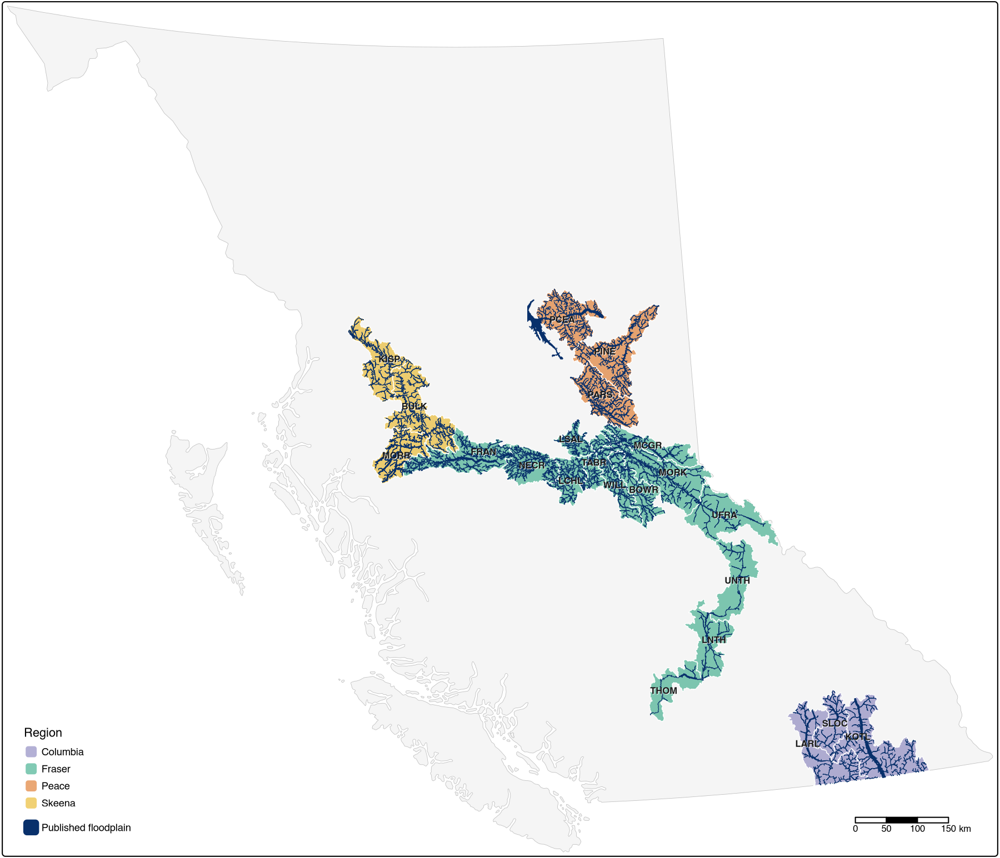
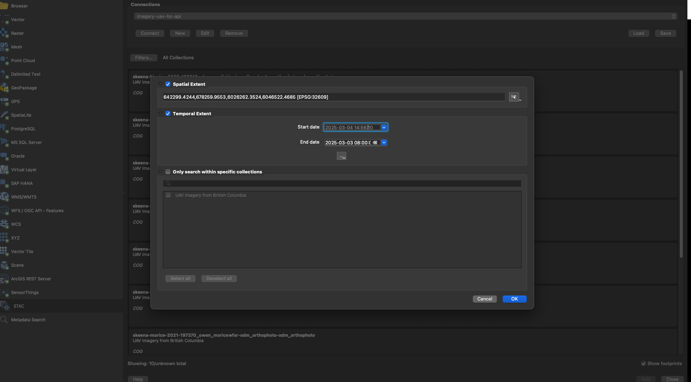

stac-floodplains-bc
================

<!-- README.md is generated from README.Rmd. Please edit that file -->


**`stac-floodplains-bc`** is a catalogue of how land cover changed on British Columbia’s
floodplains between 2017 and 2023 — where trees were lost, where they came back, and over what
extent — for 22 watershed groups in
4 regions. It is published as a
[SpatioTemporal Asset Catalog](https://stacspec.org/) (STAC) — a standard for describing geospatial data so a client can search it by place, time and attribute without downloading anything first. It is for restoration planners, stewardship offices and researchers who want the underlying rasters rather than a summary of them. The endpoint is <https://images.a11s.one>, readable from the [`rstac`](https://brazil-data-cube.github.io/rstac/) R package, QGIS 3.42+, or any other STAC client.



Each watershed group is coloured by region; the dark threads inside them are the published floodplains themselves. An interactive version, with every item’s figures in a popup, is at <https://www.newgraphenvironment.com/stac_floodplains_bc/>.

<br>

## What is in the catalogue

One **item** per `(watershed group, species, scenario)` target, id `<wsg>_<species>_ff0N`. Most groups publish one; MORR publishes two. Each item carries ten assets:

| asset | what it is |
|----|----|
| `classified_2017` `classified_2020` `classified_2023` | land cover in each year, clipped to the floodplain, as a Cloud-Optimized GeoTIFF. Class colours and labels are inside the file, so it opens ready to read |
| `transition_2017_2023` | what each cell changed *from* and *to* between 2017 and 2023 |
| `floodplain` | the delineated floodplain at three flood factors — `ff02`, `ff04` (functional floodplain), `ff06` (valley bottom) |
| `floodplain_landcover` | the classified years and the transition patches as polygons |
| `transition_vector` | the transition patches alone — the change layer without the three dissolved epochs that carry most of the bytes |
| `style_classified` `style_floodplain` `style_transition` | QGIS layer styles, also embedded in each GeoPackage so the layers open already coloured |

Every asset publishes `file:checksum` and `file:size`, so you can confirm a download arrived intact and pin which build a figure came from. (A checksum answers *are my bytes current*, not *did the values change* — a re-encode moves every checksum.) Every GeoPackage layer carries `wsg`, `species` and `scenario`, so items merged into one file stay separable by attribute.

**The collection mixes flood factors.** `ff04` is the functional floodplain and `ff06` the wider valley bottom, so filter on `flood_factor` before comparing or summing groups — an unfiltered aggregate adds different extents together.

## Coverage

*Generated from the live API on 2026-09-04: 23 items across 22 watershed groups in 4 regions (Columbia, Fraser, Peace, Skeena), catalogue version 1.1.0.*

| WSG | Region | Species | Flood factor | Floodplain (km²) | Gross loss (ha) | Gross gain (ha) | Net (ha) |
|:---|:---|:---|:---|---:|---:|---:|---:|
| KOTL | Columbia | bull trout | ff04 | 676 | 536 | 338 | -198 |
| LARL | Columbia | bull trout | ff04 | 286 | 122 | 56 | -66 |
| SLOC | Columbia | bull trout | ff04 | 117 | 74 | 52 | -23 |
| BOWR | Fraser | chinook | ff04 | 236 | 292 | 203 | -89 |
| FRAN | Fraser | chinook | ff04 | 782 | 5,264 | 590 | -4,674 |
| LCHL | Fraser | chinook | ff04 | 233 | 912 | 1,073 | +161 |
| LNTH | Fraser | chinook | ff04 | 152 | 272 | 65 | -207 |
| LSAL | Fraser | chinook | ff04 | 186 | 560 | 650 | +90 |
| MCGR | Fraser | chinook | ff04 | 290 | 510 | 817 | +307 |
| MORK | Fraser | chinook | ff04 | 417 | 623 | 772 | +149 |
| NECR | Fraser | chinook | ff04 | 397 | 1,943 | 915 | -1,028 |
| TABR | Fraser | chinook | ff04 | 155 | 347 | 150 | -197 |
| THOM | Fraser | chinook | ff04 | 87 | 56 | 3 | -53 |
| UFRA | Fraser | chinook | ff04 | 147 | 414 | 529 | +115 |
| UNTH | Fraser | chinook | ff04 | 101 | 260 | 179 | -81 |
| WILL | Fraser | chinook | ff04 | 236 | 486 | 352 | -133 |
| PARS | Peace | bull trout | ff04 | 410 | 1,076 | 2,696 | +1,620 |
| PCEA | Peace | bull trout | ff04 | 1,052 | 84 | 137 | +53 |
| PINE | Peace | bull trout | ff04 | 380 | 763 | 1,497 | +734 |
| BULK | Skeena | coho | ff04 | 387 | 1,565 | 827 | -738 |
| KISP | Skeena | chinook | ff04 | 190 | 199 | 693 | +494 |
| MORR | Skeena | coho | ff04 | 358 | 309 | 576 | +268 |
| MORR | Skeena | chinook | ff06 | 372 | 343 | 606 | +264 |
| **Total** |  |  |  | **7,273** | **17,008** | **13,775** | **-3,233** |

Gross loss is area tree-covered in 2017 but not 2023, gross gain the reverse, net is gain minus loss — so a negative number is net tree loss. `Floodplain (km²)` is each item’s **own** extent at its own flood factor, which is why the `Flood factor` column matters. Across the catalogue: **7,273 km²** of floodplain, **17,008 ha** lost, **13,775 ha** gained, **-3,233 ha** net. That km² total counts each group’s `ff04` extent once — MORR’s two items share one physical floodplain — while the tree-change figures sum every item; rows are rounded, so a column need not sum exactly to its unrounded total.

**2 items published `deprecated: true`** (`mcgr_ch_ff04`, `pine_bt_ff04`). They were modelled before a bankfull-units fix in `flooded` and over-map the floodplain, so their figures read high — republished rather than withdrawn, because a withdrawn item is invisible while a deprecated one is a warning a client can act on.

## Query it

``` r
library(rstac)

items <- rstac::stac("https://images.a11s.one/") |>
  rstac::stac_search(collections = "stac-floodplains-bc", limit = 1000) |>
  # add `rstac::ext_query(flood_factor == 6)` for valley-bottom items only. Filter on
  # flood_factor, not scenario: scenario is species-pinned and would miss a future co_ff06.
  rstac::post_request() |>
  rstac::items_fetch()
```

A raster asset streams — no download needed. Paste the `/vsicurl/` path into QGIS’s Add Raster Layer dialog, or read it from the command line. `GDAL_DISABLE_READDIR_ON_OPEN` stops GDAL spending a dozen wasted requests probing for sidecar files that are not there:

``` bash
GDAL_DISABLE_READDIR_ON_OPEN=EMPTY_DIR \
  gdalinfo /vsicurl/https://stac-floodplains-bc.s3.us-west-2.amazonaws.com/kotl_bt_ff04/classified_2023.tif
```

### From QGIS, filtered to your area of interest

QGIS 3.42+ speaks STAC natively — Data Source Manager → STAC → New, with the endpoint URL and no authentication:


Then **Filters…** restricts the search to your own area of interest — Spatial Extent takes the current map view or any extent you draw, Temporal Extent a date range — so you get back only the items covering the ground you are working on. The dialog below is shown against a sister collection on the same endpoint; it works identically here.



Lutra Consulting’s [STAC in QGIS post](https://www.lutraconsulting.co.uk/blogs/stac-in-qgis) walks through it in more detail.

## How it is built, and where

**No modelling happens in this repository.** It stages the outputs another repository produced, converts the rasters to Cloud-Optimized GeoTIFFs, tags them, uploads them, and registers the STAC collection. If a number needs recomputing it is fixed upstream and republished here. The chain, each link its own repository:

[`fresh`](https://github.com/NewGraphEnvironment/fresh) (stream network) → [`link`](https://github.com/NewGraphEnvironment/link) (habitat interpretation) → [`flooded`](https://github.com/NewGraphEnvironment/flooded) (floodplain delineation) → [`drift`](https://github.com/NewGraphEnvironment/drift) (land-cover change) → [`floodplains`](https://github.com/NewGraphEnvironment/floodplains) (driver) → **this repository** (publish only)

The rebuild and release commands, the guards protecting a bucket with no versioning, and the release recipe are in [`scripts/README.md`](scripts/README.md).

## Credits

Two different debts, and they are not the same thing.

**Method and software this work is built on**

| whose | what | licence |
|----|----|----|
| [Devin Cairns — BlueGeo](https://github.com/bluegeo/bluegeo) | the Valley Confinement Algorithm that `flooded` adapts | MIT |
| [USDA Rocky Mountain Research Station](https://research.fs.usda.gov/rmrs) | the original valley-confinement method — the VCA Toolbox | — |
| [Simon Norris — `bcfishpass`](https://github.com/smnorris/bcfishpass) | lateral habitat assembly, and the modelling approach `link` reproduces | Apache 2.0 (software); its database is ODbL and the contents DbCL |

**Data the published products derive from** — [Impact Observatory](https://planetarycomputer.microsoft.com/api/stac/v1/collections/io-lulc-annual-v02) with Esri and Microsoft (`io-lulc-annual-v02` land cover, CC BY 4.0, via Microsoft Planetary Computer), [Natural Resources Canada](https://datacube.services.geo.ca/stac/api/collections/mrdem-30) (`mrdem-30`, the terrain the floodplains are delineated off, OGL — Canada) and the Province of British Columbia (Freshwater Atlas stream network, OGL — British Columbia). The land cover **was modified**: clipped to modelled floodplain extents and cross-tabulated 2017 against 2023 into transitions. Saying so is a condition of CC BY, which is why the collection’s `sci:citation` says it too.

## Licence

The scripts here are [MIT](LICENSE). The published catalogue — everything under `s3://stac-floodplains-bc` and the collection at `images.a11s.one` — is [CC BY 4.0](https://creativecommons.org/licenses/by/4.0/), published as the collection’s `license` alongside six `providers`, a `rel: license` link and a `sci:citation`. Why that combination is the right one, read from each producer’s own record, is in [`ATTRIBUTION.md`](ATTRIBUTION.md).

## Sister collections on the same endpoint

- [`stac_dem_bc`](https://github.com/NewGraphEnvironment/stac_dem_bc) — LidarBC elevation (`stac-elevation-bc`)
- [`stac_airphoto_bc`](https://github.com/NewGraphEnvironment/stac_airphoto_bc) — historic airphoto thumbnails, 1963–2019 (`stac-airphoto-bc`)
- [`stac_uav_bc`](https://github.com/NewGraphEnvironment/stac_uav_bc) — UAV imagery, organized by watershed (`imagery-uav-bc-prod`)
